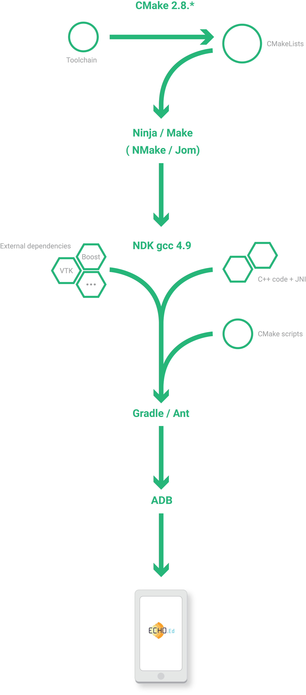

:title: Développement Android avancé
:data-transition-duration: 1200
:author: Frédéric CHAMP
:description: JDEV20115
:keywords: presentation
:css: css/presentation.css
:skip-help: true

.. role:: main-color
.. role:: big-bold
.. role:: bold-color
.. role:: big-bold-color
.. role:: funny-font

.. role:: mail
.. role:: git
.. role:: twit

.. role:: bullet-grey
.. role:: bullet-grey-bold
.. role:: bullet-green-bold

----

:id: first_slide
:data-scale: 2

|
|
|
|
|

Advanced Android Development
========================================

:main-color:`Next level with C++`
----------------------------------

**Frederic CHAMP**

----

:data-scale: 1
:data-y: r1500

:funny-font:`Android development Overview :`
--------------------------------------------

:bullet-grey:`Accessible language:` :bold-color:`Java`

:bullet-grey:`Easy for` :bold-color:`cross-platform` development

:bullet-grey:`Great and well documented` :bold-color:`Android Java API`

----

:id: but_slide
:data-y: r1500

|

:funny-font:`But ...`
=====================

----

:data-y: r1500

:funny-font:`In our case :`
--------------------------------------------

:bullet-grey:`Nobody is a Java/Android expert`

:bullet-grey:`Small team`

:bullet-grey:`We are working with a` :bold-color:`C++ framework fw4spl`

----

:data-y: r470

:funny-font:`characteristics:`
-------------------------------

:bullet-green-bold:`Object/services` design

:bullet-green-bold:`Component based`

:bullet-grey:`Developed` in :bold-color:`C++`

:bullet-grey:`Applications` built in :bold-color:`XML`

:bullet-green-bold:`Multi platforms`

:bullet-grey:`Depends` on many :bold-color:`open source libraries`: boost, VTK, ...

----

:data-y: r470

:funny-font:`statistics :` 
---------------------------

:bullet-grey:`Applications:` :bold-color:`35` (PoC and Tutorials)

:bullet-grey:`Bundles:` :bold-color:`52` (57 on private repository)

:bullet-grey:`Service` number: :bold-color:`230` (380)

:bullet-grey:`Code` line numbers: :bold-color:`+ 220 000`

----

:data-x: r1500

fw4spl :funny-font:`history:`
==============================

:bullet-grey-bold:`2004-2007` : fw4spl project

:bullet-grey-bold:`2007-2009` : :bold-color:`VRRender` 0.7 (free)

:bullet-grey-bold:`09/2009` : fw4spl became :bold-color:`open-source (LGPL)`

:bullet-grey-bold:`2010` : PoC :bold-color:`Sofa` (Altran-Est), VRRender WLE 0.8.1 (free)

:bullet-grey-bold:`2011` : PoC :bold-color:`Kinect` (Altran-Est), VRRender 0.9 (open)

:bullet-grey-bold:`2012` : Introduction of multithreading

:bullet-grey-bold:`2013` : Creation of a board (:bold-color:`IRCAD`, :bold-color:`IHU`, :bold-color:`Visible Patient`)

----

:data-y: r470

:bullet-grey-bold:`2013` : Creation of fw4spl external repository

:bullet-grey-bold:`2014` : Switch to :bold-color:`CMake` for building

:bullet-grey-bold:`2014` : Creation of :bold-color:`GitHub` and **Bitbucket** repositories

:bullet-grey-bold:`2014` : Partial :bold-color:`Android` support

:bullet-grey-bold:`2015` : Documentation generated on :bold-color:`ReadTheDocs.org`

:bullet-grey-bold:`2015` : Creation of a blog for developers

----

:id: center_poster
:data-y: r-470
:data-x: r1500

.. image:: media/poster.png
           :width: 70%

----

|
|
|
|
|

:id: dev_workflow
:data-scale: 2
:data-y: r-5440

:funny-font:`How to use this C++ framework on`
------------------------------------------------

:bold-color:`Android` ?
=======================

----

:data-scale: 1
:data-y: r1500

Environment :
==============

:funny-font:`Android :`
---------------------------

:bullet-grey:`Android SDK:` r21 :bold-color:`API 19` -> (boost issues)

:bullet-grey:`Android NDK:` r10e

:bullet-grey:`APK generators:` :bold-color:`Gradle` and :bold-color:`Ant`

:funny-font:`C++ (11):`
---------------------------

:bullet-grey:`Buidl tool:` :bold-color:`CMake`

:bullet-grey:`Toolchain:` Forked from :bold-color:`taka-no-me` one's (GitHub)

:bullet-grey:`Compiler:` :bold-color:`gcc 4.9` provided by the NDK

:bullet-grey:`Debugger:` ...

----

:id: img_workflow
:data-x: r1500

Workflow :
==============

----

:data-scale: 0.5
:data-y: r-100
:data-x: r-150

----

:data-scale: 0.5
:data-x: r400

----

:data-scale: 0.5
:data-y: r250
:data-x: r-200

----

:data-scale: 1
:data-y: r450

----

:data-scale: 0.5
:data-y: r-100
:data-x: r-150

----

:data-scale: 0.5
:data-x: r400

----

:data-scale: 0.5
:data-y: r150

----

:data-scale: 0.5
:data-y: r250
:data-x: r-200

----

:data-scale: 0.5
:data-y: r250

----

:data-scale: 0.75
:data-y: r350

----

:data-scale: 2.5
:data-y: r-850

----

:data-scale: 1
:data-y: r1500

`Native VTK
<https://github.com/FredChamp/JDEV2015/tree/master/src/>`_

.. raw:: html

       <video width="720" height="640" controls>
          <source src="media/native.mp4" type="video/mp4">
          Your browser does not support the video tag.
       </video>
       
----

:data-scale: 1
:data-x: r-1500

`fw4spl
<https://github.com/fw4spl-org/>`_

.. raw:: html

       <video width="720" height="640" controls>
          <source src="media/droidtracking.mp4" type="video/mp4">
          Your browser does not support the video tag.
       </video>
       
----

:data-scale: 2
:data-x: r2000
:data-y: r-3500

:funny-font:`Contacts :`
-----------------------------------

:mail:`frederic.champ@ircad.fr`
:git:`github.com/FredChamp`
:twit:`@frdChamp`

.. ----
..
.. :data-x: r1500
..
.. :funny-font:`The goals :`
.. -----------------------------------
..
.. - :big-bold:`Code` :big-bold-color:`reuse`
.. - :big-bold:`Developping` :big-bold-color:`time`
.. - :big-bold:`Easy to` :big-bold-color:`maintain`
..
.. ----
..
.. :data-x: r1500
..
.. :funny-font:`Slide styles`
.. --------------------------
..
.. The difference with a classic presentation that's you can have different :main-color:`slide styles` ...
..
.. ----
..
.. :data-x: r1500
..
.. :id: circle-no-background
..
.. |
.. |
.. |
.. |
.. |
..
.. :funny-font:`Look that !`
.. --------------------------
..
.. A :main-color:`circle` shape :)
..
.. ----
..
.. :data-x: r1500
..
.. :id: circle-background
..
.. |
.. |
.. |
.. |
.. |
..
.. :funny-font:`Look again !`
.. --------------------------
..
.. A :main-color:`circle` shape with :main-color:`background` :)
..
.. ----
..
.. :data-rotate-y: 90
.. :data-x: r1500
..
.. You don't like cirlce slide ? :(
..
.. Ok, I have something for you... :)
.. ========================================
..
.. ----
..
.. :data-y: r1500
..
.. :id: square-no-background
..
.. |
.. |
.. |
..
.. Do you like this ?
..
.. A :main-color:`square` shaped slide ;)
.. ========================================
..
..
.. ----
..
.. :data-y: r1500
..
.. :id: square-background
..
.. |
.. |
.. |
..
.. Or maybe you prefer this:
..
.. A :main-color:`square` slide with :main-color:`background` ;)
.. =============================================================
..
.. ----
..
.. :data-rotate-x: 90
.. :data-y: r1500
..
.. Ready for the next step ?
..
.. Let's add some pretty stuffs :)
.. ========================================
..
.. ----
..
.. :data-y: r1500
..
.. :funny-font:`CSS shapes`
.. ------------------------
..
.. You can include some :main-color:`CSS shapes` ...
..
.. ----
..
.. :data-y: r1500
..
.. Look at those...
..
.. Simple tiny :main-color:`shapes` !
.. ========================================
..
.. .. raw:: html
..
..     A triangle pointing down:
..      
..     A triangle pointing up:
..      
..     A triangle right up:
..      
..     A  Circle:
..      
..
.. ----
..
.. :data-y: r1500
..
.. Let's see the trick...
..
.. CSS code example:
.. ========================================
..
.. .. code:: CSS
..
..     span.circle {
..          border-radius: 50%;
..          width: 20px;
..          height: 20px;
..          display: inline-block;
..          background-color: #a4a4a4;
..          position: relative;
..          top: 2px;
..     }
..
.. Html code in the rst file
.. ========================================
..
.. .. code:: html
..
..     A triangle pointing down:
..      
..     A triangle pointing up:
..      
..     A triangle right up:
..      
..     A  Circle:
..      

